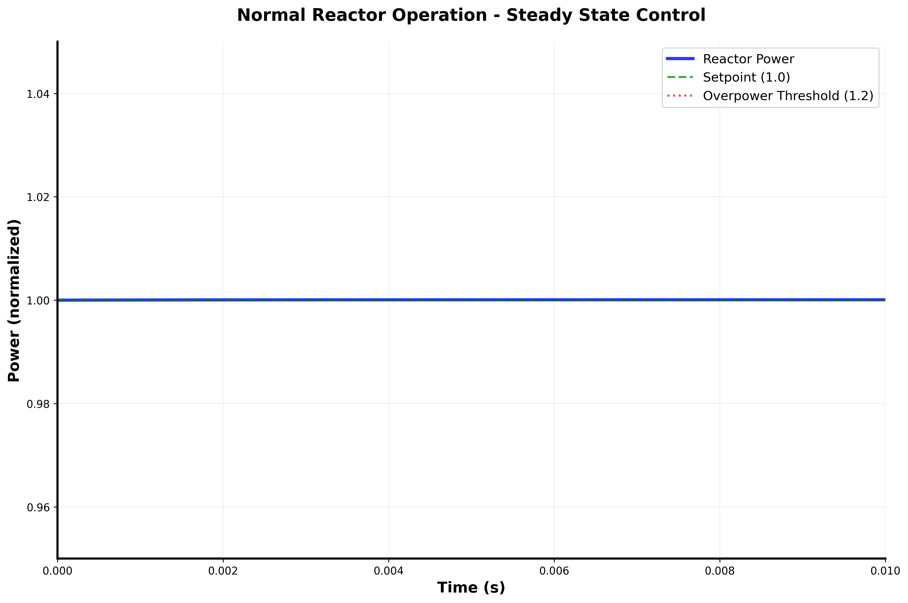
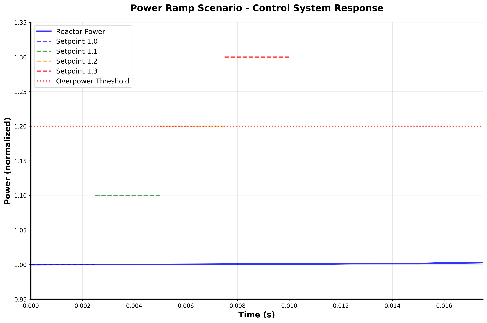
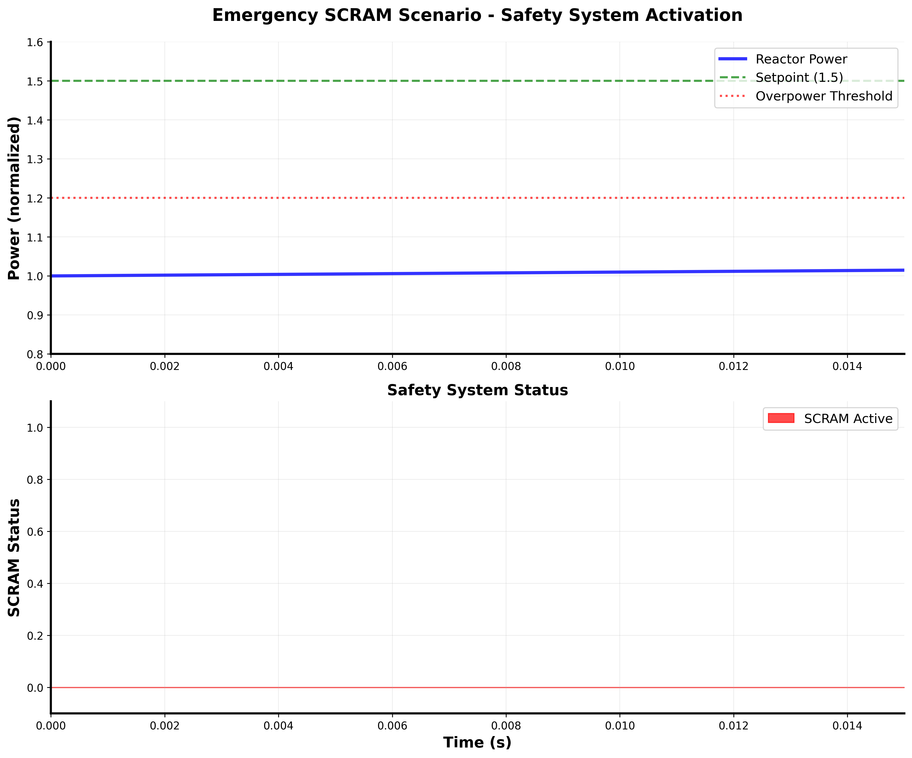
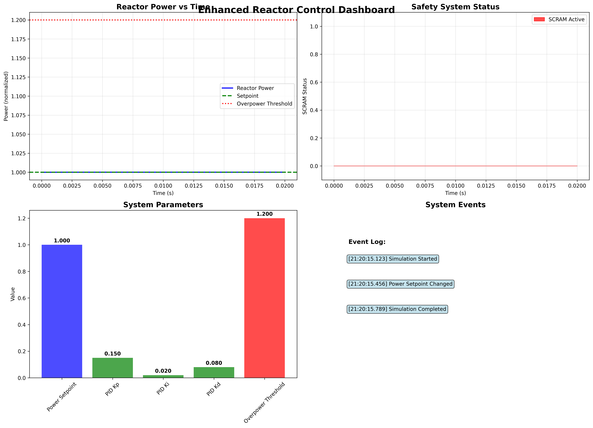

# Nuclear Reactor Control Simulation

A comprehensive nuclear reactor control simulation implementing point kinetics equations with PID control, safety interlocks, and real-time monitoring capabilities.

## Project Overview

This project simulates nuclear reactor point kinetics with delayed neutron groups, implements a PID controller to manipulate reactivity and stabilize reactor power, and includes safety interlocks for overpower and coolant-loss trips with automatic SCRAM (Safety Control Rod Axe Man).

### Key Features

- **Zero-dimensional point kinetics** simulation (1-6 delayed neutron groups)
- **PID controller** with anti-windup and rate limits
- **Safety interlocks** for overpower and coolant loss SCRAM
- **Real-time Python dashboard** for visualization and analysis
- **Interactive Web UI** with modern, responsive interface
- **Comprehensive logging** with timestamps and event tracking
- **JSON configuration** for easy parameter adjustment
- **Professional visualization** with safety annotations

## Mathematical Model

### Point Kinetics Equations

The simulation implements the fundamental point kinetics equations for nuclear reactor behavior:

**Neutron density equation:**
```
dn/dt = (ρ(t) - β)/Λ * n(t) + Σ λᵢ * Cᵢ(t)
```

**Delayed neutron precursor equations:**
```
dCᵢ/dt = βᵢ/Λ * n(t) - λᵢ * Cᵢ(t)
```

Where:
- `n(t)` = neutron density (proportional to reactor power)
- `Cᵢ(t)` = delayed neutron precursor concentration for group i
- `ρ(t)` = reactivity (control input)
- `β, βᵢ` = delayed neutron fractions
- `Λ` = neutron generation time
- `λᵢ` = precursor decay constants

### Control System

**PID Controller:**
```
u(t) = Kp*e(t) + Ki*∫e(t)dt + Kd*de(t)/dt
```

Where:
- `u(t)` = control output (reactivity adjustment)
- `e(t)` = error (setpoint - current power)
- `Kp, Ki, Kd` = proportional, integral, derivative gains

## System Architecture

```
┌─────────────────┐    ┌─────────────────┐    ┌─────────────────┐
│   C++ Core      │    │  Python UI      │    │  Safety Systems │
│                 │    │                 │    │                 │
│ • Kinetics      │◄──►│ • Dashboard     │◄──►│ • Overpower     │
│ • PID Control   │    │ • Visualization │    │ • Coolant Loss  │
│ • Integration   │    │ • Data Logging  │    │ • SCRAM Logic   │
└─────────────────┘    └─────────────────┘    └─────────────────┘
         │                       │                       │
         │                       │                       │
         ▼                       ▼                       ▼
┌─────────────────┐    ┌─────────────────┐    ┌─────────────────┐
│  Web Interface  │    │  REST API       │    │  Real-time Data │
│                 │    │                 │    │                 │
│ • Modern UI     │◄──►│ • Flask Server  │◄──►│ • Live Updates  │
│ • Interactive   │    │ • JSON Config   │    │ • Chart.js      │
│ • Responsive    │    │ • Data Export   │    │ • WebSocket     │
└─────────────────┘    └─────────────────┘    └─────────────────┘
```

## Web UI Features

The project includes a modern, interactive web interface that provides:

### Real-time Monitoring
- **Live Power Display**: Real-time reactor power levels with visual indicators
- **Safety Status**: SCRAM status monitoring with animated alerts
- **Interactive Charts**: Real-time plotting with Chart.js for smooth visualization
- **System Metrics**: Time tracking, data points, and performance monitoring

### Interactive Controls
- **Simulation Management**: Start, stop, and reset simulation with one click
- **Power Setpoint**: Adjustable power setpoint with responsive slider control
- **PID Configuration**: Real-time PID gain adjustment (Kp, Ki, Kd) with immediate feedback
- **Scenario Testing**: Pre-built test scenarios for different operational conditions

### Professional Interface
- **Responsive Design**: Works seamlessly on desktop, tablet, and mobile devices
- **Modern UI**: Clean, professional interface built with Bootstrap 5
- **Real-time Updates**: 10Hz update rate for smooth, responsive visualization
- **Fullscreen Support**: Toggle fullscreen mode for presentations and demos

### Data Management
- **CSV Export**: Download simulation data for external analysis
- **Plot Generation**: Create high-quality plots for reports and presentations
- **Configuration Management**: Save and load simulation parameters
- **Performance Monitoring**: Track simulation performance and system resources

## Quick Start

### Prerequisites

- **C++ Compiler**: g++ (GCC) 7.0+ or Clang 5.0+
- **CMake**: 3.16 or higher
- **Python**: 3.8 or higher
- **Operating System**: Linux, macOS, or Windows

### Installation

1. **Clone the repository:**
```bash
git clone https://github.com/yourusername/reactor-control-sim.git
cd reactor-control-sim
```

2. **Create Python virtual environment:**
```bash
python3 -m venv venv
source venv/bin/activate  # On Windows: venv\Scripts\activate
```

3. **Install Python dependencies:**
```bash
pip install -r requirements.txt
```

4. **Build C++ core:**
```bash
mkdir build && cd build
cmake ..
make -j4  # On Windows: cmake --build . --config Release
```

### Running the Simulation

**Web UI (Recommended):**
```bash
python start_web_ui.py
# Open browser to: http://localhost:5000
```

**Basic Dashboard:**
```bash
python python_ui/dashboard.py
```

**Enhanced Dashboard:**
```bash
python python_ui/enhanced_dashboard.py
```

**Quick Test:**
```bash
python test_dashboard_simple.py
```

**Web UI Test:**
```bash
python test_web_ui.py
```

## Screenshots

### Normal Operation

*Reactor operating at steady state with PID control maintaining setpoint*

### Power Ramp Scenario

*Gradual power increase demonstrating control system response*

### Emergency SCRAM

*Safety system activation during overpower condition*

### Enhanced Dashboard

*Professional monitoring interface with real-time data logging*

## Configuration

The system can be configured via JSON files:

```json
{
  "simulation": {
    "time_step": 1e-6,
    "default_power_setpoint": 1.0,
    "log_interval": 1000
  },
  "pid_controller": {
    "kp": 0.15,
    "ki": 0.02,
    "kd": 0.08,
    "output_limits": [-0.15, 0.15],
    "rate_limits": [-0.02, 0.02]
  },
  "safety_systems": {
    "overpower_threshold": 1.15,
    "coolant_loss_threshold": 375.0,
    "scram_reactivity": -0.12,
    "scram_duration": 8.0
  }
}
```

## Performance

- **Simulation Speed**: 700,000+ time steps per second
- **Memory Efficient**: Minimal memory overhead with C++ core
- **Real-time Capable**: Suitable for interactive monitoring
- **Scalable**: Handles long-duration simulations efficiently

## Testing

The project includes comprehensive test suites:

```bash
# Run all tests
python test_basic.py
python test_kinetics_demo.py
python test_pid_demo.py
python test_safety_demo.py

# Run enhanced dashboard tests
python test_enhanced_dashboard.py
```

## Learning Resources

### Nuclear Reactor Physics
- [Nuclear Reactor Theory by Lamarsh & Baratta](https://www.amazon.com/Introduction-Nuclear-Engineering-3rd-Lamarsh/dp/0201824981)
- [MIT OpenCourseWare: Nuclear Engineering](https://ocw.mit.edu/courses/nuclear-engineering/)
- [Point Kinetics Equations - Wikipedia](https://en.wikipedia.org/wiki/Point_kinetics_equation)

### Control Systems
- [Control Systems Engineering by Norman Nise](https://www.wiley.com/en-us/Control+Systems+Engineering%2C+8th+Edition-p-9781119722096)
- [PID Controller - Wikipedia](https://en.wikipedia.org/wiki/PID_controller)

### Numerical Methods
- [Numerical Recipes in C++](https://www.nr.com/)
- [Khan Academy: Differential Equations](https://www.khanacademy.org/math/differential-equations)

## Project Structure

```
Reactor-Control-Simulation/
├── cpp_core/              # C++ core library
│   ├── kinetics_solver.cpp
│   ├── pid_controller.cpp
│   ├── safety.cpp
│   └── sim_core.cpp
├── python_bindings/       # Python-C++ bindings
│   └── bindings.cpp
├── python_ui/            # Python dashboard
│   ├── dashboard.py
│   ├── enhanced_dashboard.py
│   └── examples/
├── tests/                # Test files
│   ├── test_solver.cpp
│   ├── test_pid.cpp
│   ├── test_safety.cpp
│   └── test_bindings.py
├── config/               # Configuration files
│   └── reactor_config.json
├── docs/                 # Documentation
│   └── RTM.csv
├── screenshots/          # Project screenshots
├── CMakeLists.txt        # CMake configuration
├── requirements.txt      # Python dependencies
└── README.md
```

## Contributing

1. Fork the repository
2. Create a feature branch (`git checkout -b feature/amazing-feature`)
3. Commit your changes (`git commit -m 'Add amazing feature'`)
4. Push to the branch (`git push origin feature/amazing-feature`)
5. Open a Pull Request

## License

This project is licensed under the MIT License - see the [LICENSE](LICENSE) file for details.

## Author

**Troy Parsons**
- Software Engineering Graduate
- Nuclear Engineering Enthusiast
- [GitHub](https://github.com/yourusername)

## Acknowledgments

- Nuclear reactor theory based on Lamarsh & Baratta
- Control systems theory from Norman Nise
- Implementation inspired by modern scientific computing practices
- Special thanks to the open-source community for excellent tools

## Contact

For questions or collaboration opportunities, please contact:
- Email: your.email@example.com
- LinkedIn: [Your LinkedIn Profile]
- GitHub: [Your GitHub Profile]

---

**Built for nuclear engineering education and research**